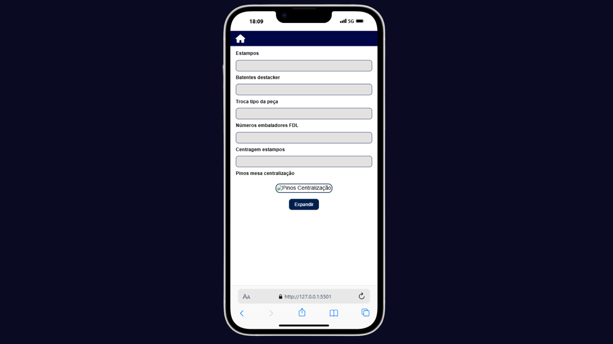

# Projeto de interface

Pré-requisitos: <a href="02-Especificacao.md"> Especificação do projeto</a>

O projeto de interface foi desenvolvido visando agilidade operacional e praticidade no acesso às informações industriais, atendendo às necessidades identificadas nas personas e histórias de usuários. A proposta prioriza navegação intuitiva, organização clara das informações e responsividade, permitindo que os colaboradores realizem consultas e registros diretamente pelo smartphone, eliminando a dependência exclusiva de estações desktop.

 ## Arquitetura da Interface

A interface é estruturada em módulos independentes, integrados por uma navbar superior e menu lateral (drawer), permitindo acesso rápido às principais funcionalidades. A navegação foi projetada para minimizar cliques e oferecer fluxos lineares, essenciais em contextos produtivos com alta demanda por agilidade.

- **Página Inicial:** ponto central de interação, com campo de busca responsivo para inserção de códigos de peças e botões de acesso rápido às consultas mais frequentes (Dados da Peça, Ciclo de Corte, Ciclo de Produção e Posicionamento Destacker).
 
- **Páginas de Consulta Técnica:** exibição estruturada de dados operacionais em formato de campos de leitura (inputs bloqueados), permitindo rápida identificação de parâmetros críticos. Imagens técnicas possuem recurso de expansão (zoom) para detalhamento visual.
 
- **Menu Lateral (Navbar):** acesso modular às funcionalidades de análise, gestão e registro.

### Navbar

   - **Gerar Gráficos:** filtros por linha, ID e período (mensal/diário), com exportação em Excel e PNG para relatórios de desempenho.
  
   - **Carta de CEP:** interface de coleta de dados de produção, armazenando registros essenciais para análise estatística.
   
   - **Ordens de Serviço:** módulo de criação, edição e acompanhamento de ordens, com controle de prioridade e status.
  
   - **Máquinas:** monitoramento do estado operacional (operando, parada, manutenção) e acesso ao histórico de falhas.
 
   - **Almoxarifado:** consultas de estoque e simulação de consumo para gestão de materiais.
   
   - **Segurança:** registro e rastreamento de ocorrências, com busca por código e galpão.
   
   - **Preventivas:** agenda de manutenções preventivas com calendário interativo.
  
   - **DMC (Redução de Custos):** criação e acompanhamento de propostas para otimização de processos e redução de custos.

### Fluxo de Navegação
A navegação foi desenhada para minimizar tempo de execução das tarefas e reduzir a curva de aprendizado:

**1. Entrada do Código da Peça** na Página Inicial.

**2. Seleção do Módulo** (consulta técnica, geração de gráficos, gestão de ocorrências, etc.).

**3. Interação direta com os dados,** com suporte a exportação, registros e análises em tempo real.

Esse fluxo garante que o usuário realize suas atividades com o menor número de interações possíveis, atendendo aos requisitos funcionais RF01 a RF20.

---------------

## Interface do sistema

Visão geral da interação do usuário por meio das telas do sistema. 

### Tela - Página Principal

A imagem apresenta a página inicial do aplicativo, projetada para permitir acesso rápido às principais funcionalidades. No topo, há uma barra de navegação fixa com ícone de menu lateral e a logo da empresa logo abaixo. Ao centro, um campo de busca permite inserir o código da peça, acompanhado de um botão de pesquisa. Quatro botões principais direcionam o usuário para as páginas “Dados da Peça”, “Ciclo de Corte”, “Ciclo de Produção” e “Posicionamento Destacker”. A interface prioriza clareza e eficiência, com uma paleta de tons azulados e neutros.

### Tela - Dados da Peça

A imagem apresenta a tela dedicada à consulta de informações detalhadas sobre as peças utilizadas na produção. Os campos exibem dados como nome, número de furos, linha de origem, embalagem, quantidade por tubular e posição no destacker. Uma imagem ilustrativa da peça é destacada, com opção de expansão para visualização ampliada. Todos os campos são apresentados em formato de entrada para facilitar a consulta sem permitir alterações.

### Tela - Ciclo de Corte

A imagem apresenta a tela voltada para exibição dos parâmetros do ciclo de corte das peças. São apresentados dados técnicos, incluindo comprimento, largura, espessura, qualidade, símbolo blank, pedana e quantidade de blanks por fardo. Uma representação visual do corte está disponível, com opção de expandir para análise detalhada. O layout foi desenhado para garantir a fácil leitura das informações.

### Tela - Ciclo de Produção

A imagem apresenta a tela responsável pela visualização das etapas e ajustes do ciclo de produção. São exibidos dados sobre estampos, batentes do destacker, trocas do tipo da peça, número de embaladores FDL, centragem dos estampos e pinos da mesa de centralização. A organização das informações prioriza a clareza e a rápida consulta.

### Tela - Posicionamento Destacker

A imagem apresenta a tela que exibe duas imagens técnicas relacionadas ao posicionamento do destacker. Cada imagem pode ser expandida para visualização detalhada, permitindo que o usuário analise com precisão os ajustes necessários. O design busca otimizar a apresentação visual para garantir precisão e compreensão.

### Tela - Menu Lateral

A imagem apresenta o menu lateral do aplicativo, acessado pelo ícone ☰ na barra de navegação. Este menu oferece acesso rápido a funcionalidades adicionais: “Gerar Gráficos”, “Carta de CEP”, “Ordens de Serviço”, “Máquinas”, “Almoxarifado”, “Segurança”, “Preventivas” e “DMC”. A navegação é intuitiva e mantém a identidade visual consistente em todo o sistema.

### Tela - Gerar Gráficos

A imagem apresenta a tela dedicada à geração de gráficos analíticos. O usuário pode selecionar linha, ID e período (mensal ou diário) para criar representações visuais de desempenho. Botões para exportação em formatos Excel e PNG estão disponíveis, facilitando o compartilhamento e análise dos dados.

### Tela - Carta de CEP

A imagem apresenta a tela destinada à coleta de dados pós-produção, essenciais para alimentar os relatórios analíticos. O formulário inclui campos para data, hora, linha, turno, team leader, operador, fornecedor, inspeções, refugos/reparação e produção. Um botão “Salvar” garante o registro das informações, que posteriormente serão utilizadas na geração de gráficos.

### Tela - Ordens de Serviço

A imagem apresenta a tela dedicada à criação e acompanhamento de ordens de serviço. Um campo de busca no topo permite filtrar ordens existentes pelo código. Ao clicar no botão “+”, abre-se um modal com campos para preencher problema, descrição, prioridade e status, seguido do botão “Salvar”. O design prioriza organização e rastreabilidade.

### Tela - Máquinas

A imagem apresenta a tela para gerenciamento do status e histórico das máquinas. Um campo de busca no topo permite localizar máquinas pelo código. Cada máquina possui dois botões: “Falhas”, que exibe o histórico de falhas, e “Alterar”, que permite atualizar o status operacional (operando, parada ou em manutenção). A estrutura garante agilidade na gestão dos equipamentos.

### Tela - Almoxarifado

A imagem apresenta a tela destinada à consulta de materiais e simulação de consumo. A interface foi desenhada para facilitar a visualização do estoque e otimizar o planejamento de reposição.

### Tela - Segurança

A imagem apresenta a tela de registro e acompanhamento de ocorrências de segurança. Dois campos de busca permitem filtrar registros por código ou galpão. Ao clicar no botão “+”, o usuário acessa um modal para preenchimento de galpão, área, registro, UTE e relato do acidente, finalizando com o botão “Salvar”. A tela prioriza rastreabilidade e clareza nas informações.

### Tela - Preventivas

A imagem apresenta a tela dedicada ao agendamento e acompanhamento de manutenções preventivas. Um calendário exibe, com pontos destacados, os dias com preventivas agendadas. O botão “+” abre um modal para registrar data e descrição da manutenção. A interface prioriza organização e previsibilidade.

### Tela - DMC

A imagem apresenta a tela voltada para o registro de propostas de redução de custos nas peças, permitindo a geração de novos cálculos e análises. O layout simples foca na eficiência do processo e na clareza das informações inseridas.

