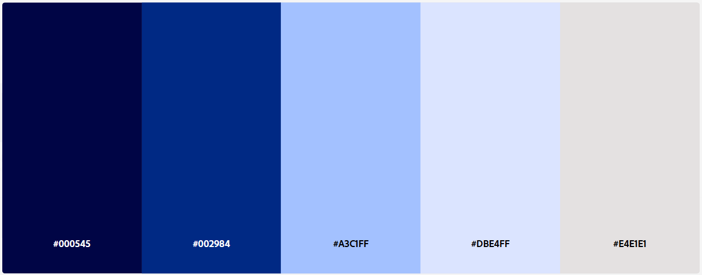

# Template padrão da aplicação
Pré-requisitos: <a href="02-Especificacao.md"> Especificação do projeto</a>, <a href="03-Metodologia.md"> Metodologia</a>, <a href="04-Projeto-interface.md"> Projeto de interface</a>

Este tópico descreve o processo de definição da identidade visual do aplicativo Gestão Industrial Mobile, incluindo cores, tipografia, logotipo e elementos que garantem uma experiência prática e consistente para o usuário.

## Identidade visual

A identidade visual do aplicativo foi projetada para refletir os valores de eficiência, acessibilidade e modernização dos processos industriais. O objetivo não é apenas estético: busca-se transmitir a praticidade de ter informações essenciais na palma da mão, reduzindo a dependência de sistemas exclusivamente baseados em desktop.

A criação do layout foi orientada pela necessidade de oferecer uma interface simples e funcional, capaz de ser utilizada rapidamente em ambientes industriais. A estética privilegia clareza e objetividade, alinhadas à ideia de um aplicativo de apoio operacional, pensado para otimizar rotinas diárias.

A escolha visual enfatiza o conceito de mobilidade e agilidade, essenciais em um contexto onde colaboradores frequentemente precisam acessar informações longe de um computador ou notebook. A abordagem reforça que a tecnologia pode ser ao mesmo tempo moderna, intuitiva e não intrusiva.

## Paleta de Cores

Para a construção visual do aplicativo, foi selecionada uma paleta de tons azulados e neutros (#000545, #002984, #A3C1FF, #DBE4FF, #E4E1E1), escolhida estrategicamente para transmitir profissionalismo, confiabilidade e clareza na comunicação de dados operacionais — atributos essenciais para aplicações voltadas à gestão e acompanhamento de processos produtivos.

O azul é amplamente associado a precisão, estabilidade e confiança, valores diretamente relacionados a sistemas corporativos e industriais. Tons mais escuros reforçam a seriedade e a robustez tecnológica da aplicação, enquanto as variações mais claras oferecem leveza e acessibilidade visual, proporcionando uma interface agradável mesmo em longos períodos de uso.

A paleta foi planejada para equilibrar modernidade e eficiência, reforçando a identidade técnica da aplicação e criando um ambiente visual coerente com seu propósito: agilizar o acesso a informações, otimizar processos e apoiar a tomada de decisões no contexto produtivo.

### Harmonia em Tons de Azul

Esta paleta foi escolhida para transmitir profissionalismo, confiança e clareza, características essenciais para sistemas industriais e de gestão de dados, garantindo uma comunicação visual eficiente e confiável.

- **#000545 — Azul Profundo:** simboliza precisão, seriedade e robustez tecnológica, transmitindo estabilidade na apresentação das informações.
 
- **#002984 — Azul Corporativo:** reforça confiança e eficiência, alinhando-se ao contexto de processos produtivos e tomada de decisão.

- **#A3C1FF — Azul Claro:** proporciona leveza e acessibilidade visual, garantindo conforto ao usuário durante longos períodos de uso.

- **#DBE4FF — Azul Suave:** cria equilíbrio e neutralidade, facilitando a leitura e organização dos dados.
 
- **#E4E1E1 — Cinza Neutro:** contribui para a harmonia geral da interface, destacando elementos essenciais sem sobrecarregar a experiência visual.

A predominância dos tons azulados e neutros conecta-se à tecnologia, confiabilidade e eficiência operacional, além de reforçar a identidade visual moderna e objetiva do aplicativo.

## Iconografia

Os ícones seguem o princípio da clareza e associação imediata, utilizando traços simples e padronizados. Cada ícone foi escolhido para reforçar o propósito da funcionalidade que representa, mantendo harmonia com a paleta azul e evitando poluição visual.

A iconografia tem como objetivos:

- Facilitar a identificação das funcionalidades;

- Tornar a navegação mais intuitiva;
 
- Reforçar o caráter prático e direto do aplicativo.

## Design Responsivo

O (NOME) foi projetado exclusivamente para dispositivos móveis, considerando a praticidade e a frequência com que colaboradores utilizam smartphones no dia a dia. O layout foi pensado para garantir rápida interação, fácil navegação e leitura clara em telas pequenas, priorizando elementos essenciais e evitando sobrecarga visual.

A interface utiliza componentes responsivos, que se ajustam automaticamente a diferentes tamanhos de tela, garantindo que a experiência do usuário permaneça fluida, independentemente do dispositivo. Essa abordagem elimina a dependência de notebooks ou desktops, oferecendo acesso imediato às informações necessárias, sempre que e onde for preciso.

